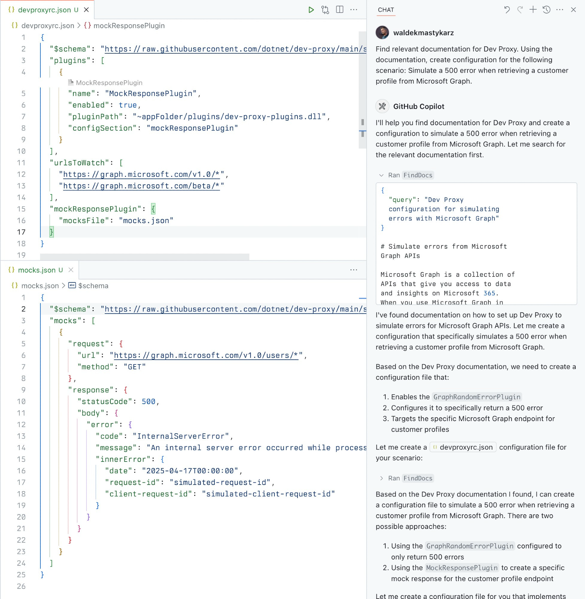

# Dev Proxy MCP Server

[](https://insiders.vscode.dev/redirect/mcp/install?name=Dev%20Proxy%20MCP%20Server&config=%7B%22command%22%3A%22npx%22%2C%22args%22%3A%5B%22-y%22%2C%22%40devproxy%2Fmcp%40latest%22%5D%7D) [](https://insiders.vscode.dev/redirect/mcp/install?name=Dev%20Proxy%20MCP%20Server&config=%7B%22command%22%3A%22npx%22%2C%22args%22%3A%5B%22-y%22%2C%22%40devproxy%2Fmcp%40latest%22%5D%7D&quality=insiders)

A Model Context Protocol (MCP) server for [Dev Proxy](https://aka.ms/devproxy) that enables AI assistants to interact with Dev Proxy capabilities using the MCP standard. Use this server to:

1. Create Dev Proxy configurations using natural language
1. Get contextual help for working with Dev Proxy
1. Discover Dev Proxy features and capabilities



## What is Dev Proxy?

Dev Proxy is an API simulator that helps you effortlessly test your app beyond the happy path. It allows you to:

- **Test API error handling**: See how your app responds to API errors without changing your code
- **Verify rate limit handling**: Simulate API rate limits to improve user experience
- **Test slow API responses**: See how your app handles slow APIs to implement necessary affordances
- **Create mock APIs**: Quickly stand up mock APIs without writing code you won't ship

Dev Proxy works with any type of app and tech stack as it intercepts network requests at the proxy level.

## What This Package Does

This package provides a Model Context Protocol (MCP) server interface to Dev Proxy. It allows AI assistants and other MCP-compatible clients to:

1. **Find Dev Proxy documentation** using natural language queries
2. **Get the installed Dev Proxy version**

## Prerequisites

- [Node.js](https://nodejs.org/) LTS
- [Dev Proxy](https://learn.microsoft.com/microsoft-cloud/dev/dev-proxy/get-started/set-up) installed globally

## Usage

To set up and use the MCP server, refer to the instructions for your MCP host, such as [Visual Studio Code](https://code.visualstudio.com/docs/copilot/chat/mcp-servers#_add-an-mcp-server). The Dev Proxy MCP server is published on npm under [`@devproxy/mcp`](https://www.npmjs.com/package/@devproxy/mcp).

### Connect with an MCP Client

This MCP server exposes the following tools:

#### FindDocs

Finds relevant Dev Proxy documentation related to a specific query.

```json
{
  "query": "How to simulate API errors"
}
```

#### GetVersion

Gets the currently installed Dev Proxy version. This is useful to ensure that the generated configuration is compatible with the installed version of Dev Proxy.

```json
{}
```

## Development

```bash
# Clone the repository
git clone https://github.com/waldekmastykarz/dev-proxy-mcp.git
cd dev-proxy-mcp

# Install dependencies
npm install

# Build the project
npm run build

# Run the server
npm start

# Run with MCP inspector for debugging
npm run inspect
```

## Contributing

Contributions are welcome! Please feel free to submit a Pull Request.

1. Fork the repository
2. Create your feature branch (`git checkout -b feature/amazing-feature`)
3. Commit your changes (`git commit -m 'Add some amazing feature'`)
4. Push to the branch (`git push origin feature/amazing-feature`)
5. Open a Pull Request

## License

This project is licensed under the MIT License - see the LICENSE file for details.

## Related Projects

- [Dev Proxy](https://learn.microsoft.com/microsoft-cloud/dev/dev-proxy/overview) - The core Dev Proxy tool
- [Model Context Protocol (MCP)](https://modelcontextprotocol.io) - Protocol specification for AI assistant tools
